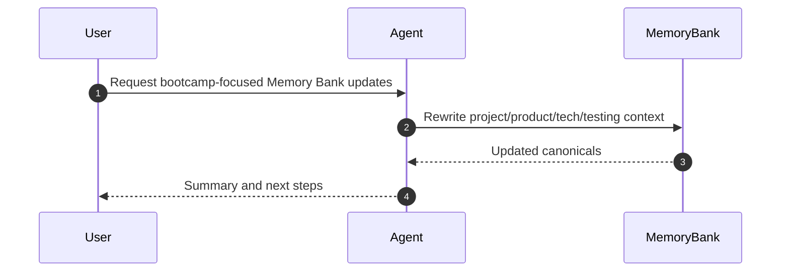

# Update bootcamp memory bank

## Requirements
- [x] EARS user stories and acceptance criteria captured.
- EARS user stories:
  - When a learner opens the Memory Bank, the documentation shall describe the bootcamp purpose, audience, and exercise scope.
  - When a learner looks up technical context, the documentation shall point to the actual frontend and backend entrypoints in this repo.
  - When a learner checks testing guidance, the documentation shall reference the current tooling and test locations.
- Acceptance criteria:
  - `agents/memory-bank/project.brief.md` reflects the bootcamp scope and exercises.
  - `agents/memory-bank/product.context.md` describes beginner-focused goals and UX principles.
  - `agents/memory-bank/tech.context.md` reflects current repo layout and toolchain.
  - `agents/memory-bank/testing.guidelines.md` references Vitest, Testing Library, and Supertest where applicable.
  - References to old infra/CDKTF context are removed or rewritten.
- Non-goals:
  - No changes to application code or exercises.
  - No new tests beyond documentation updates.
- Constraints / Risks:
  - Use ASCII-only edits in Memory Bank files.
  - `AGENTS.md` is referenced by workflow docs but not found in repo (risk: missing markdown standards).
- Invariants:
  - Memory Bank structure and retrieval policy remain intact.
  - Scope stays limited to documentation updates under `agents/memory-bank/**`.
- Interfaces / files / tests to touch:
  - `agents/memory-bank/project.brief.md`
  - `agents/memory-bank/product.context.md`
  - `agents/memory-bank/tech.context.md`
  - `agents/memory-bank/testing.guidelines.md`
  - `agents/specs/task-specs/2025-12-28-bootcamp-memory-bank.md`
- Retrieval sources consulted:
  - `agents/memory-bank.md`
  - `agents/memory-bank/project.brief.md`
  - `agents/memory-bank/product.context.md`
  - `agents/memory-bank/tech.context.md`
  - `agents/memory-bank/testing.guidelines.md`
  - `client-website/package.json`
  - `node-server/package.json`
  - `client-website/src/app/page.tsx`
  - `node-server/src/index.ts`
- Reflection (requirements):
  - Scope is clear: update Memory Bank docs only, remove old infra references, and align with the bootcamp exercises.

## Design
- Architecture (logical, data, control flows):
  - Update canonical Memory Bank docs to align with current repo structure and bootcamp goals.
  - Replace old monorepo/infra assumptions with the actual frontend/backend layout.
- Sequence diagram(s):

- Interfaces / contracts:
  - None.
- Edge / failure behaviors:
  - If `AGENTS.md` remains missing, follow existing Markdown conventions in updated files.
- Reflection (design):
  - The simplest design is to rewrite the four canonicals and keep workflow mechanics unchanged.

## Implementation Planning
- Tasks and outcomes:
  - Rewrite project brief, product context, tech context, and testing guidelines for bootcamp scope.
  - Update task spec phases and decision log.
- Dependencies / blockers:
  - None.
- Test plan mapped to acceptance criteria:
  - Run `npm run memory:validate` or `npm run agent:finalize` if available; otherwise document that validation was not run.
- Memory Bank updates:
  - Update `agents/memory-bank/project.brief.md`, `agents/memory-bank/product.context.md`,
    `agents/memory-bank/tech.context.md`, and `agents/memory-bank/testing.guidelines.md`.
- Reflection (implementation planning):
  - The work is doc-only, so execution should be straightforward once updates are drafted.

## Execution
- Progress log:
  - Updated Memory Bank canonicals for bootcamp scope and repo layout.
  - Ran Memory Bank validation script.
  - Attempted `npm run agent:finalize` but root `package.json` is missing.
- Evidence / tests:
  - `node agents/scripts/validate-memory-bank.mjs`
  - `node agents/scripts/git-diff-with-lines.mjs`
  - `npm run agent:finalize` (failed: no root `package.json`)
- Follow-ups:
  - Decide whether to add a root `package.json` with `agent:finalize` script.
- Reflection (execution):
  - The docs are updated; validation succeeded, but the finalize script could not run without a root package.

## Decision & Work Log
- 2025-12-28: User requested bootcamp Memory Bank updates via one-off spec; proceed with documentation-only changes.
